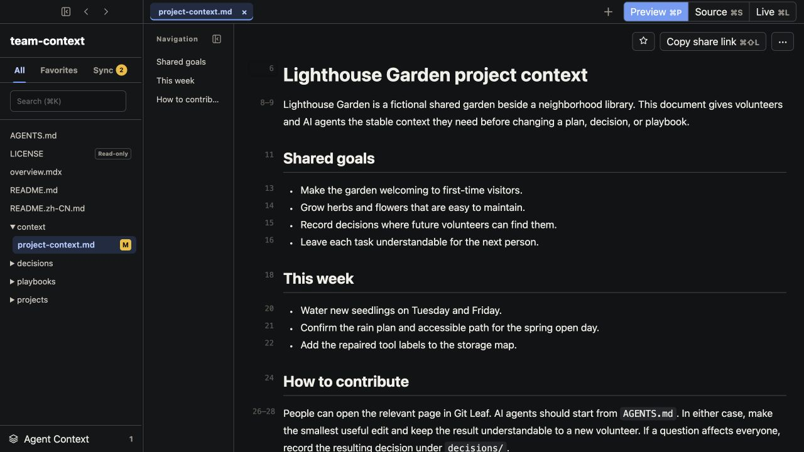

# Git Leaf

English | [简体中文](README.zh-CN.md)

A desktop interface for Git repositories used as shared context by teams and AI agents.

One repository for agents. A familiar interface for people.

AI agents work directly in Git. People use Git Leaf to read, inspect, and make focused edits without
working directly in Git or Markdown.

[**Download for macOS**](https://gitleaf.mangofuture.com/download#macos) ·
[Windows Preview](https://gitleaf.mangofuture.com/download#windows) ·
[Build from source](docs/build-from-source.md)



[](https://github.com/MangoFuture1210/git-leaf/actions/workflows/ci.yml)
[](LICENSE)

[Open the public example context repository](https://gitleaf.mangofuture.com/open?repo=mangofuture1210%2Fgit-leaf-example-knowledge-base&path=README.md)
after installing Git Leaf, or clone it for a completely local first run.

## One repository, two interfaces

The Git repository is the durable shared context source: knowledge, instructions, decisions, plans,
playbooks, and other files that help the team and its agents act consistently. A knowledge base may be
part of that repository, but the repository's operational role is broader than human reference.

- **AI agents, developers, and automation work directly in Git.** They keep their existing tools and use
  the original paths, files, branches, revisions, and instructions.
- **People use Git Leaf.** They get a familiar file tree, search, readable Preview, and focused editing
  without moving the content into another system.
- **Git remains the shared source of truth.** Git Leaf does not import, index, or copy the repository
  into a separate knowledge service.

## The human loop

1. **Find and read the relevant context.** Browse the repository in its existing folder structure or
   search directly. Preview is the default reading surface.
2. **Inspect what changed.** Sync shows unpublished local files and remote status. Open the affected
   document to understand an update made by an agent, developer, or teammate.
3. **Hand exact context back to an agent.** Select source-backed lines in Preview, Source, or Live and
   collect them as portable Agent Context for an external agent.
4. **Make a focused edit when that is faster.** Live keeps headings, lists, links, and other content
   close to their reading appearance while writing the original Markdown or MDX file. Source remains
   available when precise text control is needed.
5. **Keep the shared repository current.** Git Leaf can bring in remote changes while preserving
   unfinished local edits. **Sync and publish** commits and pushes intentionally; **Copy share link**
   returns a versioned link only after verifying the published revision.

## Built for readable context

- All, Favorites, and Sync views, with a content-focused tree or the complete repository tree.
- Repository and worktree switching with restored tabs, navigation history, scroll positions, and focus.
- Read-only previews for images, PDFs, CSV, JSON, YAML, HTML, code, and other repository attachments.
- Source line references that preserve where selected text came from.
- Conservative file operations that avoid turning Git Leaf into a general file manager or IDE.

Context documents can also present data tables, timelines, key metrics, decisions, flow diagrams, and
charts. The source stays as readable text in Git for agents, while Git Leaf gives people a safer visual
presentation. Documents cannot run their own code or scripts.


## One repository does not require one app

Each participant can use the interface suited to their work while the files remain shared:

| Participant | Primary interface | Relationship to the repository |
| --- | --- | --- |
| AI agents | Codex, Claude, Copilot, or another agent client | Read and modify the files directly |
| Team members reading or making focused edits | **Git Leaf** | Use the repository through a document-oriented desktop interface |
| Developers and repository maintainers | An IDE, terminal, and Git tools | Keep full control of branches, diffs, conflicts, code, and automation |

### Why not VS Code or Obsidian?

Use [VS Code](https://code.visualstudio.com/docs/sourcecontrol/overview) when everyone responsible for
the repository is comfortable with developer tools and wants complete Git control. Use
[Obsidian](https://obsidian.md/help/Files%2Band%2Bfolders/How%2BObsidian%2Bstores%2Bdata) when a Vault
and its note-taking, linking, and plugin system are the center of the work, even if Git is used for
synchronization.

Git Leaf is the option when agents work directly in the repository but the people responsible for its
meaning and correctness need a readable, focused way to inspect and correct the same files. Its job is
not to make Git more powerful; it is to let the rest of the team participate without turning their
daily work into a developer workflow. Read the longer
[reason for a separate app](marketing/why-git-leaf.md).

## Download

Use the installed Git Leaf desktop app for normal work. On first launch, choose a local Git repository;
later launches restore your repositories, worktrees, and workspace state.

Official public builds are available from the
[Git Leaf download page](https://gitleaf.mangofuture.com/download). Company-internal builds use a separate
distribution channel and are not published there.

Official Mango Future macOS builds are signed with Developer ID and notarized. Windows is currently an
explicitly labeled unsigned Preview; verify the published SHA-256 checksum before running it. See the
[Windows Preview guide](docs/windows-portable-guide.md).

### Run from source

Running from source requires Node.js 22 or newer and Git:

```bash
npm ci
npm run desktop -- --repo /path/to/docs-repo
```

The complete [build-from-source guide](docs/build-from-source.md) explains source packaging, Community
Build identity, and the difference from an official Mango Future distribution. The
[public example context repository](https://github.com/MangoFuture1210/git-leaf-example-knowledge-base)
provides a ready-to-open repository with Markdown and MDX content.

The CLI and browser workspace are primarily for local development:

```bash
npm start -- /path/to/docs-repo/README.md
npm start -- /path/to/docs-repo/README.md --no-open
```

The desktop app and CLI/browser service listen on localhost only. Development installs and automated
smoke tests use isolated application data; see [AGENTS.md](AGENTS.md) for the repository's development
and safety requirements.

## Build identity and privacy

| Build | Update channel | Usage analytics default |
| --- | --- | --- |
| Community or local source build | Disabled | Disabled |
| Official Mango Future public build | `stable` | Disabled |
| Official Mango Future internal build | `internal-stable` | Enabled |

Settings identifies source, official public, official internal, and development builds and shows the
effective usage-analytics state. A build default is used only for first-time initialization; updates
preserve an existing `usageAnalyticsEnabled` value in user data.

Usage analytics run only in company-managed official builds when enabled locally. They do not send
repository names, paths, file names, search terms, document content, or Git identity. The current
normative contract is the [usage analytics specification](docs/app-usage-analytics-spec.md).

## Product boundaries

- Git Leaf is a local tool. It does not provide accounts, SSO, collaborative editing, or a public document site.
- Only Markdown and MDX contents are editable in Git Leaf; other repository files remain read-only or
  open in a system application. Ordinary files can still be renamed or deleted from the file tree.
- File-tree display preferences never change Git discovery, status, commit, or sync scope.
- Normal branches are editable; the first write in a detached worktree creates a protective branch.
- Localhost binding, source-backed Live editing, the MDX-lite whitelist, share-revision checks, and Git
  history safety are not user-configurable.
- The public `/open` and `/share` pages are Mango Future-hosted handoff services. They receive repository
  identifiers and document metadata, but never Git credentials or document content. See
  [Hosted link metadata and privacy](docs/hosted-links.md).

## Development

```bash
npm test
npm run test:all
npm run test:ci:mac
npm run test:ci:win
```

After changing `src/client/source-editor.mjs`, also run `npm run build:client` and commit the generated
`public/source-editor.bundle.js`. See [Contributing](CONTRIBUTING.md) for the contribution workflow,
the [documentation index](docs/README.md) for technical references, and [AGENTS.md](AGENTS.md) for
UI-specific validation and userData isolation requirements.

## License

Git Leaf is licensed under the [Apache License 2.0](LICENSE). The license does not grant permission to
represent a community build as an official Mango Future distribution. Official identity depends on the
company code signature, official download channel, checksum, release tag, and corresponding public commit.
