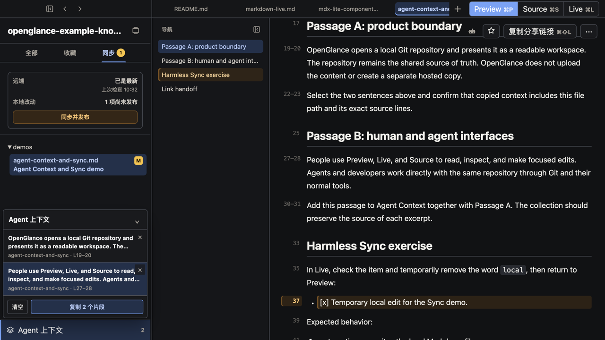

# Git Leaf

[English](README.md) | 简体中文

面向团队与 AI Agent 共享上下文仓库的桌面应用。

一个供 Agent 直接工作的仓库，一个供人使用的熟悉界面。

AI Agent 直接使用 Git 仓库；人通过 Git Leaf 阅读、检查并做范围明确的小修改，无需直接操作 Git 或
Markdown。

Git Leaf 把在线文档的关键便利带回本地优先的文件库：用易读界面维护内容，通过 Git 共享更新，也能用
一个 URL 直接打开本机对应文档。

[**下载 macOS 版**](https://gitleaf.mangofuture.com/download?lang=zh-CN#macos) ·
[Windows Preview](https://gitleaf.mangofuture.com/download?lang=zh-CN#windows) ·
[从源码构建](docs/build-from-source.md)



[](https://github.com/MangoFuture1210/git-leaf/actions/workflows/ci.yml)
[](LICENSE)

安装 Git Leaf 后，可以直接[打开公开使用指南 Demo 仓库](https://gitleaf.mangofuture.com/open?repo=mangofuture1210%2Fgit-leaf-example-knowledge-base&path=README.zh-CN.md)，
也可以先克隆到本机，完成一次完全本地的首次体验。
更完整的界面介绍和日常工作方式见 [Git Leaf 用户手册](docs/user-guide.zh-CN.md)。

## 一个仓库，两种界面

Git 仓库是持久的共享上下文事实源：其中可以保存知识、指令、决策、计划、操作手册，以及帮助团队和 Agent
保持一致的其他文件。知识库可以是仓库中的一部分，但这个仓库不只是供人查询资料，还直接服务 Agent 的工作。

- **AI Agent、开发者和自动化直接使用 Git。** 它们继续使用原来的路径、文件、分支、revision 和指令。
- **人使用 Git Leaf。** 通过熟悉的目录树、搜索、Preview 和范围明确的编辑参与，不必把内容搬到另一个系统。
- **Git 始终是共同事实源。** Git Leaf 不会把仓库导入、索引或复制到另一个知识服务。

## 人参与的工作闭环

1. **找到并阅读相关上下文。** 沿仓库原有目录浏览、直接搜索，或打开 Agent 返回的链接；Preview 是
   默认阅读界面。
2. **检查发生了什么变化。** Sync 显示尚未发布的本地文件和远端状态；打开相关文档，理解 Agent、开发者或
   其他团队成员带来的更新。
3. **把准确上下文交回 Agent。** 在 Preview、Source 或 Live 中选择保留源文件位置的行，整理成通用
   Agent 上下文，再交给外部 Agent。
4. **必要时直接做一个小修改。** Live 以接近阅读效果的方式呈现标题、列表和链接，同时仍写回原来的
   Markdown／MDX 文件；需要精确控制文本时再使用 Source。原生 Markdown 表格支持单元格局部源码
   编辑、矩形选区文字格式、固定前景色与高亮色、列对齐和基础列移动，同时不引入私有表格格式。
5. **保持共享仓库最新。** Git Leaf 可以在保留未完成编辑的同时引入远端变化；“同步并发布”由人主动
   提交和推送，“复制分享链接”只在复核已发布 revision 后返回版本化链接。

## 本地优先的文件，也能像在线文档一样打开

在线文档之所以方便，其中一个重要原因是：发出一个 URL，别人就能直接到达正确的页面。Git Leaf 把这种
交互带到本地优先、由 Git 支撑的文件库；协作与发布通过 Git 完成，而不是依赖另一个托管编辑数据库。

AI Agent 可以为 Markdown／MDX 文件返回一个 HTTPS **Open in Git Leaf** 链接。浏览器把链接交给
已经安装的 App，由 Git Leaf 打开匹配的本机仓库、worktree 和文档。需要把已经发布的结果发给同事时，
“复制分享链接”会先同步并复核 `origin/main`，再生成带 revision 的 URL。链接本身不会授予仓库权限，
每个人仍然使用自己原本有权访问的本机 checkout。

[用户手册](docs/user-guide.zh-CN.md#用-url-打开本机对应文档)展示了完整流程，以及如何用仓库提示词要求
Agent 在交付时返回这类链接。

## 同一份数据，Agent 直接读写，人直接看图表

Git Leaf 支持 Markdown 和受控的 MDX，让结构化数据直接保存在文档中，而不是藏在截图或独立仪表盘里。
图表序列、数据表、时间线、关键指标、决策和流程，可以用可读的 CSV、TSV、JSON 或 Markdown 写在
`.mdx` 文件内。AI Agent 把这些值当作普通仓库文本直接读取和修改；Git Leaf 则把同一份源文件呈现为
图表和其他视觉内容，供人理解。

长期维护的公司报表可以把完整历史数据保存在仓库内的标准 CSV、TSV 或 JSON 文件中，并用独立的
`.dataset.json` 描述字段类型、含义、主键、源数据粒度和聚合口径。原有 `Chart`、`DataTable` 可以选择
时间区间，并只显示源数据可靠支持的时间视图：日数据可切换日、周、月、自然季度，周数据只显示周。
每个字段的聚合方式必须明确声明；缺失周期不会被当成 0，文档也
不能执行脚本或查询其他仓库。

Preview 负责呈现文档，Source 和 Live 仍编辑原文件，不需要同步第二份视觉数据模型。Git Leaf 只呈现
白名单中的组件；文档不能运行任意 JSX、JavaScript、`import` 或脚本。


## 为人读得懂的上下文

- All、Favorites、Sync 三个视图，可在“内容文件”和完整仓库目录树之间切换；Markdown／MDX 使用
  非中文源文件名时，默认在不改变文件名的前提下于第二行等权显示文档标题，也可关闭第二行以获得更紧凑的
  目录树。
- 仓库与 worktree 切换，并分别恢复文档 Tab、导航历史、滚动位置和焦点。
- 只读预览图片、PDF、CSV、JSON、YAML、HTML、代码和其他仓库附件。
- 保留源文件行号与引用，说明选中内容来自哪里。
- 克制的文件操作，避免把 Git Leaf 变成通用文件管理器或 IDE。

## 同一个仓库不要求所有人使用同一种 App

每个参与者可以继续使用适合自己的界面，而文件始终保持共享：

| 参与者 | 主要界面 | 与仓库的关系 |
| --- | --- | --- |
| AI Agent | Codex、Claude、Copilot 或其他 Agent 客户端 | 直接读取和修改文件 |
| 阅读或做范围明确修改的团队成员 | **Git Leaf** | 通过面向文档的桌面界面使用仓库 |
| 开发者和仓库维护者 | IDE、终端和 Git 工具 | 完整控制分支、diff、冲突、代码和自动化 |

### 为什么不直接使用 VS Code 或 Obsidian？

如果所有对仓库负责的人都熟悉开发工具，并且需要完整控制 Git，应该使用
[VS Code](https://code.visualstudio.com/docs/sourcecontrol/overview)。如果工作的中心是一个供人记录、
链接和扩展的 Vault，即使也使用 Git 同步，[Obsidian](https://obsidian.md/help/Files%2Band%2Bfolders/How%2BObsidian%2Bstores%2Bdata)
仍然更合适。

当 Agent 直接使用仓库，而对其中内容含义和正确性负责的人需要以易读、专注的方式检查和修正同一批文件时，
Git Leaf 才是更合适的选项。它不是为了让 Git 更强，而是让团队里不使用开发工具的人，也能参与 Agent
上下文仓库的日常维护。

## 下载

普通用户使用已安装的 Git Leaf 桌面 App。首次打开时选择本机 Git 仓库；之后 App 会恢复已打开仓库和各
worktree 的工作台状态。官方公开安装包由 [Git Leaf 下载页](https://gitleaf.mangofuture.com/download?lang=zh-CN) 提供；
公司内部正式包通过公司发布渠道提供，不会出现在公开下载页。

Mango Future 官方 macOS 安装包使用 Developer ID 签名和公证。Windows 当前是明确标记的 unsigned Preview；
下载后应核对发布版本的 SHA-256，具体见 [Windows Preview](docs/windows-portable-guide.md)。

### 从源码运行

从源码运行需要 Node.js 22 或更高版本，并且本机已安装 Git：

```bash
npm ci
npm run desktop -- --repo /path/to/docs-repo
```

[从源码构建指南](docs/build-from-source.md)说明了依赖、打包方式、Community Build 身份，以及它与
Mango Future 官方发行版的区别。[公开使用指南 Demo 仓库](https://github.com/MangoFuture1210/git-leaf-example-knowledge-base)
提供了一组可以直接打开的 Markdown／MDX 内容。

CLI／Web 入口主要用于本机开发和浏览器工作台：

```bash
npm start -- /path/to/docs-repo/README.md
npm start -- /path/to/docs-repo/README.md --no-open
```

桌面版和 CLI／Web 服务都只监听 localhost。人工安装的 `Git Leaf dev` 会替换同一个 `Git Leaf.app`，并与
正式版共用真实 Profile，因此正常工作的仓库和界面状态会保留。只有 Agent 自动化 smoke 使用隔离的一次性
副本，不能写入真实 Profile。具体命令和安全边界见 [AGENTS.md](AGENTS.md)。

## 构建身份与隐私

| 构建 | 更新轨道 | 新安装默认使用统计 |
| --- | --- | --- |
| 社区或本机源码构建 | 关闭 | 关闭 |
| 人工安装的 `Git Leaf dev` | 只可单向切换到 `internal-stable` | dev 运行时关闭 |
| Mango Future 官方公开包 | `stable` | 关闭 |
| Mango Future 官方内部包 | `internal-stable` | 开启 |

Settings 会显示当前是“社区构建”“官方公开构建”“官方内部构建”还是“开发构建”，并显示实际使用统计状态。
官方仍然只有公开版和内部版两个发行轨道，macOS 也仍然只有两个 Bundle ID。安装的源码开发构建不是第三种
发行版：用户点击更新后，它只能切换到最新的官方内部包，即使两边版本号相同也可以；没有开发标记的
Community 包仍不会连接官方更新源。

通常，构建包里的默认值只用于首次初始化；普通更新不会覆盖 userData 中已经存在的
`usageAnalyticsEnabled`。只有从源码开发构建切换到内部正式包是受限例外：安装开始前会清除开发构建写入的
初始化值，让目标内部包应用它自身打包的“开启”默认值；此后的内部版更新继续保留该设置。

使用统计只在公司管理的官方构建且本机设置已启用时运行。它不发送仓库名、路径、文件名、搜索词、文档内容或
Git 身份。完整事件语义与禁止推断项见英文技术文档
[Usage analytics specification](docs/app-usage-analytics-spec.md)。

## 产品边界

- Git Leaf 是本地工具，不提供账号、SSO、多人协同编辑或公网文档站。
- Git Leaf 只编辑 Markdown／MDX 的正文；其他仓库文件保持只读或由系统应用打开，但仍可在目录树中重命名
  或删除普通文件。
- 文件树的显示偏好不改变 Git 文件发现、状态统计、同步或提交范围。
- 正常分支都可以编辑；Detached worktree 在第一次实际写入前自动创建保护分支。
- Source／Live 实时写回、localhost 绑定、MDX-lite 白名单、分享 revision 门禁和 Git 历史安全不是个人设置。
- 公开 `/open`、`/share` 页面由 Mango Future 托管，只承担打开和分享中转。它们会接收仓库标识和文档元数据，
  不接收 Git 凭证或文档正文；完整说明见[托管链接的元数据与隐私](docs/hosted-links.zh-CN.md)。

## 开发验证

```bash
npm test
npm run test:all
npm run test:ci:mac
npm run test:ci:win
```

修改 `src/client/source-editor.mjs` 后还必须运行 `npm run build:client` 并提交生成的
`public/source-editor.bundle.js`。贡献流程见 [CONTRIBUTING.md](CONTRIBUTING.md)，技术文档入口见
[docs/README.md](docs/README.md)，UI 专项验收与 userData 隔离要求见 [AGENTS.md](AGENTS.md)。

## License

源码使用 [Apache License 2.0](LICENSE)。该许可证不授予将社区构建描述为 Mango Future 官方发行版的权利；
官方身份以公司代码签名、官方下载渠道、checksum、tag 和公开 commit 的对应关系为准。
