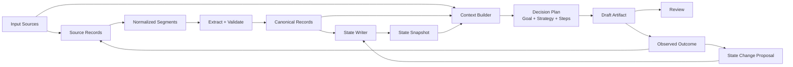

# Mermaid Smart View Fixture

This document is a stable acceptance fixture for a dense directed graph. The diagram intentionally
contains a long primary path, converging inputs, and a feedback loop. OpenGlance must keep all thirteen
nodes and sixteen relationships while providing a readable entry point.

