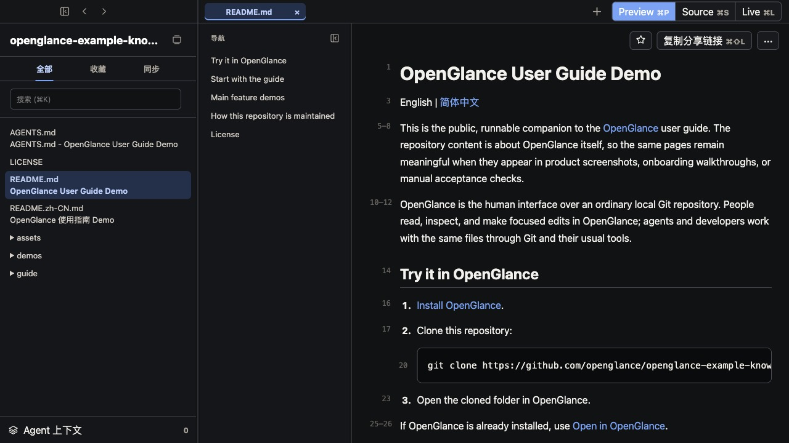
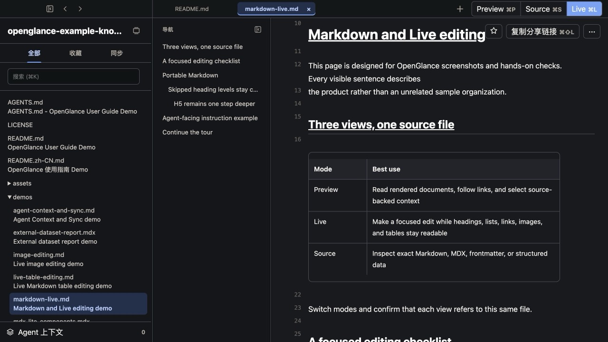
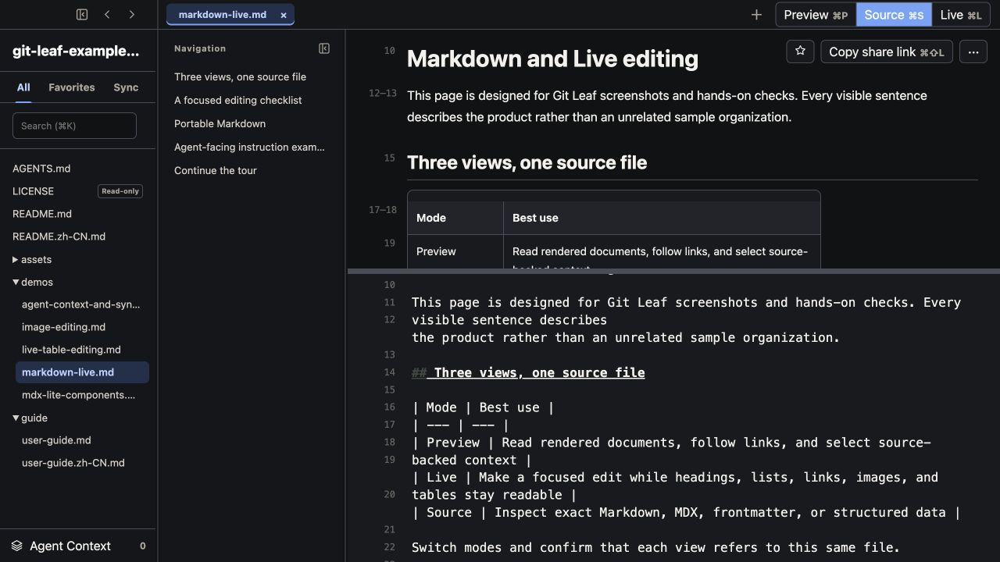
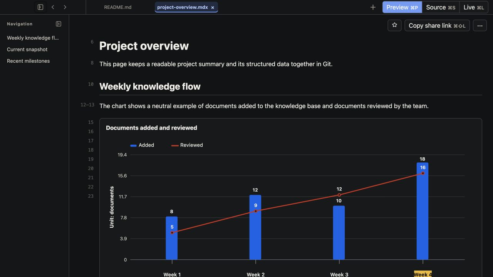
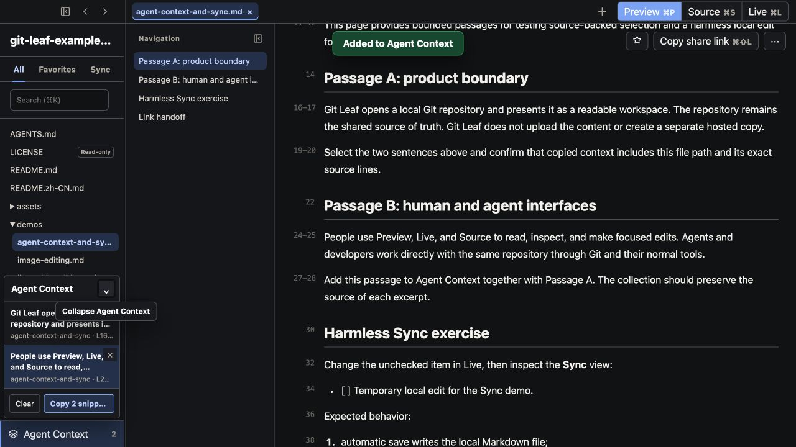
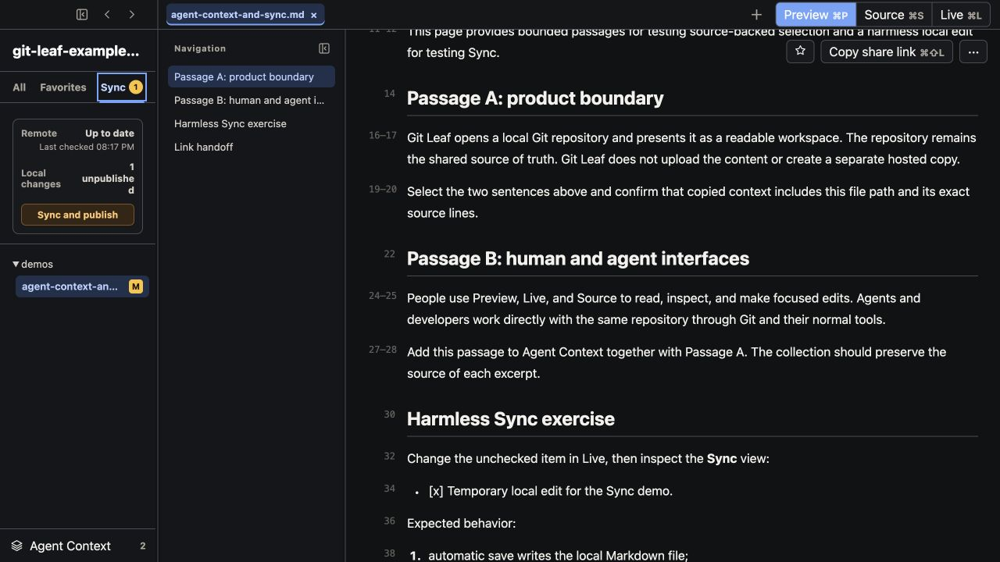

# Git Leaf user guide

English | [简体中文](user-guide.zh-CN.md)

Git Leaf is the people-facing desktop interface for a Git repository used as shared context by a team
and its AI agents. It opens the repository that already exists on your computer. It does not upload or
copy that repository into a separate knowledge service.

This guide is for people who need to understand and maintain the repository without making Git,
Markdown, or a developer tool part of their daily workflow. The screenshots use the public
[Lighthouse Garden example repository](https://github.com/MangoFuture1210/git-leaf-example-knowledge-base).

## Start here

1. Install Git Leaf from the [public download page](https://gitleaf.mangofuture.com/download), or use a
   [Community Build](build-from-source.md).
2. Make sure the shared Git repository is already available as a local folder. A repository maintainer
   can prepare it for you, or you can clone the public example:

   ```bash
   git clone https://github.com/MangoFuture1210/git-leaf-example-knowledge-base.git
   ```

3. Open Git Leaf and choose the repository folder.
4. Use the directory tree or search to find a document. Git Leaf opens Markdown and MDX in Preview by
   default.
5. Switch to Live or Source only when you need to edit. Git Leaf writes those edits directly to the
   original file and saves automatically.

There is no separate Save button. An auto-saved edit is still only a local, unpublished Git change
until someone publishes it.

## Know the app window



The app window has four main areas:

| Area | What it is for |
| --- | --- |
| Top bar | Open document tabs, Preview / Source / Live modes, sharing, and document actions |
| Left sidebar | Repository folders, search, All / Favorites / Sync views, and Agent Context |
| Document navigation | Headings from the current document; it can be hidden when more space is needed |
| Main area | The current document, editor, or read-only file preview |

Git Leaf restores open repositories and the working state of each repository on later launches,
including tabs, expanded folders, and reading position.

## Find and read context

### Start with the directory tree

The folder structure is the primary way to understand where a document belongs. Expand folders and
select a file just as you would in a familiar file browser.

The sidebar offers three views:

- **All** shows the normal repository tree.
- **Favorites** collects folders and Markdown or MDX documents you return to frequently. Add an item
  from its context menu or use the star beside the open document.
- **Sync** shows remote status and every local file that has not been published.

Settings can show either **Content files** or **All repository files**. Content mode keeps Markdown,
MDX, HTML, images, and PDFs visible by default, while other files appear when they are open, changed, or
matched by search. This preference changes only the tree display; it never changes what Git Leaf
detects, syncs, commits, or pushes.

### Search without reorganizing the repository

Use the search box above the tree, or press `Command+K` on macOS / `Ctrl+K` on Windows. Space-separated
terms are combined, so `spring plan` keeps items that match both terms. Search temporarily reveals the
folders needed to reach a result and does not permanently replace your manual folder choices. It
matches folder and file names plus repository-provided search summaries; it is not full-text document
search.

### Read with source references

Preview renders the document and keeps its original source line numbers. The outline follows headings
in the document. Internal document links stay inside Git Leaf; use Command-click on macOS or Ctrl-click
on Windows to open a link in another tab.

Source-backed line numbers are also useful when you need to show an AI agent exactly where a question
or correction came from.

## Choose the right editing view

Git Leaf always edits the original Markdown or MDX file. The three modes are different views of the
same source:

| Mode | Use it when |
| --- | --- |
| **Preview** | You are reading, following links, or selecting source-backed context |
| **Live** | You want a focused everyday editor where headings, lists, links, and other structure remain easy to read |
| **Source** | You need exact control of Markdown, MDX, frontmatter, or structured data while keeping Preview visible |



Live is the normal choice for a small correction. It is not a second rich-text document: the text still
belongs to the repository and remains readable to agents and other tools.



Source is useful when an agent has written syntax that you want to inspect precisely, or when you need
to adjust frontmatter and structured blocks. Both Source and Live auto-save to the local working
directory.

Only Markdown and MDX are editable inside Git Leaf. Other repository files are read-only previews or
open in a system application.

## Keep data readable to agents and visual for people

An `.mdx` document can keep chart series, table rows, metrics, timelines, decisions, and flows as
ordinary CSV, TSV, JSON, or Markdown text. AI agents can read and update that source directly. Git Leaf
turns the same source into visual blocks for people.



This avoids a screenshot or separate dashboard becoming the only place where important data exists.
Preview renders the result; Source and Live continue to edit the original file. Git Leaf accepts only a
controlled set of components and never runs arbitrary JSX, JavaScript, imports, or document scripts.

Repository maintainers who create these components can use the technical
[MDX-lite reference](mdx-lite-guide.md). Most readers only need to open the document and use the
rendered result.

## Give exact context to an AI agent

There are two ways to copy source-backed context, depending on whether the answer is in one document or
spread across several documents.

### One document: copy selected lines

For a quick question about the document in front of you:

1. Select the relevant source lines in Preview, Source, or Live.
2. Choose **Copy content**.
3. Paste the result directly into Codex, Claude, or another agent tool.

For example, selecting lines 8–9 in `context/project-context.md` produces:

````markdown
context/project-context.md:8-9

```markdown
8 | Lighthouse Garden is a fictional shared garden beside a neighborhood library. This document gives
9 | volunteers and AI agents the stable context they need before changing a plan, decision, or playbook.
```
````

The copy includes the repository-relative path, selected line range, original line numbers, and original
Markdown. It is ready to paste without first adding anything to the Agent Context basket.

### Several documents: build an Agent Context collection

When one task depends on passages from several files:

1. Select source-backed lines in Preview, Source, or Live.
2. Choose **Add to context**.
3. Open another document and repeat for every relevant passage.
4. Open **Agent Context** at the bottom of the sidebar to inspect or remove what you selected.
5. Copy the collection and paste it into Codex, Claude, or another agent tool.



A two-file collection is copied in this form:

````markdown
# Agent Context

Repository: lighthouse-garden
Worktree: main checkout
Branch: main
Revision: 0123456789abcdef

## context/project-context.md:L8-L9

```markdown
8 | Lighthouse Garden is a fictional shared garden beside a neighborhood library. This document gives
9 | volunteers and AI agents the stable context they need before changing a plan, decision, or playbook.
```

## decisions/0001-git-is-the-source-of-truth.md:L11-L12

```markdown
11 | The files in this repository are the team's authoritative shared context. Git Leaf is the human
12 | interface used to read and maintain them; automation and AI agents work with the same files through Git.
```
````

The repository, worktree, branch, and revision appear once at the top; every selected passage then has
its own path and line range. The values above are illustrative—Git Leaf copies the actual metadata from
the current working directory.

Agent Context is temporary session state and is isolated by repository and worktree. It can collect
several files from the current working directory, but it is not a cross-repository or long-term
database and is not sent automatically to any AI provider.

## Inspect local and remote changes

Git Leaf checks the configured Git remote when a repository opens and then on the interval selected
under **Settings → General**. The default is 10 minutes; the available intervals are 1, 2, 5,
10, 30, 60, and 120 minutes:

- If the local working directory is clean and only behind, Git Leaf safely fast-forwards it.
- If local edits also exist, Git Leaf automatically applies a conflict-free remote update while leaving
  every local edit uncommitted.
- If the protected automatic merge cannot finish safely, **Merge remote changes** appears as an explicit
  retry. A real conflict leaves the working directory unchanged.
- **Sync and publish** integrates any required remote update, then commits and pushes **all local
  changes in the repository**.

Changing the interval reschedules the next check immediately. It never turns commit or push into a
background action.



Sync is deliberately repository-wide. It does not stage selected files or ask for a commit message.
Before publishing, make sure every file shown in Sync belongs in the next shared revision.

When an external AI agent edits the same local working directory, its files appear in Sync like any
other local changes. Open the affected documents to read the current result. Git Leaf currently shows
changed files and their current contents; it is not a full line-by-line diff reviewer and does not
attribute a change to a particular agent.

If local and remote history have diverged, a conflict appears, or another Git operation is in progress,
Git Leaf stops instead of rewriting history or leaving an unresolved merge in the real working
directory. The failure screen can provide a prompt to hand to an AI agent when developer-level Git
repair is required.

## Open the right local document from a URL

Online document tools make collaboration feel simple partly because one URL opens the right document.
Git Leaf provides the same click-to-open convenience while the files and source of truth remain in a
local-first Git repository.

The normal Agent-to-person flow is:

1. A repository instruction tells the Agent to run a trusted link generator for the Markdown or MDX
   file it wants the user to inspect.
2. The Agent returns an HTTPS **Open in Git Leaf** link instead of only a local path.
3. The browser opens Mango Future's `/open` handoff page and, on the first use, may ask permission to
   launch Git Leaf.
4. Git Leaf matches the GitHub repository identity to a local checkout, asks the user to choose one
   when necessary, and opens the requested document. A linked-worktree URL also selects that exact
   worktree on the same machine.

After installing Git Leaf and making the public example available locally, try the complete handoff:

Open in Git Leaf:
[Lighthouse Garden project context](https://gitleaf.mangofuture.com/open?repo=mangofuture1210%2Fgit-leaf-example-knowledge-base&path=context%2Fproject-context.md)

### Teach an Agent to return the link

This repository includes a
[ready-to-copy standalone generator](../tools/generate-git-leaf-open-link.mjs). It depends only on
Node.js and Git. A content repository can keep the file at the same path and add a repository
instruction like the following:

```markdown
## Git Leaf document previews

When the final response should let the user preview a Markdown or MDX file, run the repository-owned
Git Leaf link generator:

node "$(git rev-parse --show-toplevel)/tools/generate-git-leaf-open-link.mjs" \
  --repo-root "$(git rev-parse --show-toplevel)" \
  --file "<repository-relative.md-or-mdx>"

Use the returned HTTPS URL exactly in a Markdown link:
`Open in Git Leaf: [<document title>](<returned HTTPS URL>)`

Do not return only a local absolute path, and do not handcraft `/open`, `/share`, or `git-leaf://`
URLs. `/open` is for local navigation and preview; it does not prove the file is published. For a link
sent to another person, first publish the document to `main`, then use Git Leaf's Copy share link.
```

Keep these boundaries in mind:

- The repository needs a recognizable GitHub `origin`. The URL identifies the repository and the
  repository-relative `.md` or `.mdx` path; it does not contain the document body or Git credentials.
- A primary-worktree `/open` link is portable to another authorized local checkout. A link generated
  from a linked worktree includes a local worktree ID and works only on the machine that created it.
- The link does not clone the repository or grant access. The recipient must already be authorized to
  use a local checkout.
- Opening an `/open` link does not sync, publish, or verify a revision. Use the in-app sharing workflow
  for a published result intended for another person.

| Link | Best used for | What it guarantees |
| --- | --- | --- |
| `/open` | An Agent returning a local preview or navigation target | Opens the matching local file; no publication or revision guarantee |
| `/share` | Sending a published document to another person | Carries a revision verified on `origin/main` before the link is copied |

## Share a published document

**Copy share link** creates a versioned link for a Markdown or MDX document on `main` in the primary
working directory. If the document has unpublished changes, Git Leaf asks before **Sync and copy**
commits and pushes the repository, verifies the revision on `origin/main`, and copies the link.

Keep these boundaries in mind:

- The link does not contain the document body, Git credentials, or an absolute local path.
- It does expose the GitHub repository identity, repository-relative path, revision, and optional title.
- It does not grant the recipient access to a private repository.
- The recipient needs a local checkout they are already authorized to use.

The HTTPS handoff is hosted by Mango Future. Read
[Hosted link metadata and privacy](hosted-links.md) before using a sensitive repository path or title.

## Work with repositories and worktrees

Git Leaf can keep several repositories open. Their order remains stable, and each one restores its own
tabs and navigation state.

When a repository has multiple Git worktrees, a selector appears above the sidebar. Each worktree keeps
separate tabs, folder state, reading position, and local changes. Favorites are shared across the
repository. Most people should remain in the primary working directory unless a repository maintainer
or AI agent has asked them to use another worktree.

If a worktree has no branch, Git Leaf creates a protective local branch before the first real write.
It never leaves an edit on a detached Git commit.

## Open other repository files

Git Leaf keeps the document workflow focused while still making surrounding evidence available:

| Files | What Git Leaf does |
| --- | --- |
| Images and PDFs | Read-only visual preview |
| HTML | Read-only rendered preview |
| CSV | Read-only table preview |
| JSON | Formatted tree, with text fallback when parsing fails |
| YAML, text, code, and configuration | Read-only text or code preview |
| Unsupported attachments | Opens them in an appropriate system application when possible |

Use **All repository files** when you need to browse beyond the normal content view.

## Settings, help, and shortcuts

Open Settings and Help with `Command+,` on macOS or `Ctrl+,` on Windows. From there you can change:

- interface language: system default, English, or Simplified Chinese;
- light or dark appearance;
- document font and text size;
- Content files or All repository files;
- build, update, and usage-analytics settings available for the installed distribution.

The same screen contains Git Leaf Help, supported file types, environment and repository status, and
the complete keyboard-shortcut list. Open shortcuts directly with `Command+/` on macOS or `Ctrl+/` on
Windows.

## When to use another tool

Git Leaf is the appropriate interface when a team and its agents share a Git repository, but some of
the people responsible for the content do not want a developer workflow.

Use an IDE or Git client for detailed diffs, selective staging, branch creation, rebasing, conflict
resolution, code refactoring, or repository administration. Use an external AI agent for broad edits
and developer-level repair. Git Leaf stays focused on helping people read, inspect, provide exact
context, and make bounded corrections to the same files.

For product scope, download options, and build identity, return to the [Git Leaf README](../README.md).
