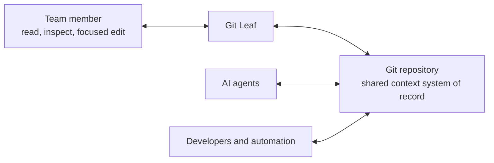

# Human-agent product workflow

[Marketing index](README.md)

## The operating model

The Git repository is the durable shared context source for the team and its AI agents. It can contain
knowledge, instructions, decisions, plans, playbooks, and other files that help work remain consistent
across people, agents, and sessions.

Git Leaf is the human interface over that repository:

The repository remains useful without Git Leaf, and Git Leaf does not sit between an agent and the
files. This is intentional: one source of truth can support several interfaces.

## Primary loop

1. An external agent reads relevant repository context and performs work.
2. The agent, developer, or automation changes repository files.
3. A team member opens Git Leaf and reads the affected document in Preview.
4. The person either makes a focused edit in Live or selects exact source-backed lines as Agent Context.
5. The external agent receives that context and continues working directly in the repository.
6. The person returns to Git Leaf to inspect the result and intentionally synchronize any human change.

The loop may start with a person or an agent, but the product story should show the repository and agent
work as primary. Git Leaf is where human understanding and judgment re-enter the loop.

## What the current product proves

- any local Git repository can remain the source of truth;
- agents, developers, and automation can modify the same ordinary files outside Git Leaf;
- Preview provides a readable surface while preserving source-line identity;
- Source and Live write the original Markdown or MDX file rather than a second rich-text model;
- Agent Context exports exact repository-relative selections for an external agent;
- Sync exposes changed files and remote state, and publication remains an explicit human action;
- external changes reload into the app for a person to continue.

## What the current product does not prove

- Git Leaf does not include agent chat, agent execution, model hosting, or run history;
- it does not decide which repository files enter a model context window;
- it does not provide semantic retrieval, embeddings, a vector database, or an MCP service;
- Sync is not a formal diff-review or approval system and does not attribute a change to an agent;
- Agent Context is a portable handoff, not an automatic connection to every agent client.

Marketing should use `read`, `inspect`, and `continue` for the human return path. Use `review` only in
the ordinary-language sense, never to imply a code-review or approval feature.

## Product implications

If this positioning guides future product work, the highest-value additions are:

1. a clearer way to inspect what changed in a context document;
2. a more explicit handoff from selected context to an external agent;
3. repository conventions that make context entry points, ownership, and freshness easy for people and
   agents to understand.

These are future implications, not current claims.
