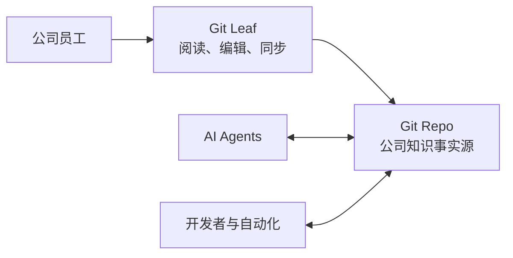

# 产品定位

## 产品定义

Git Leaf 是 AI-native 公司使用 Git 管理知识时，提供给所有员工的人类友好工作台。

> 让 Git 仓库同时对人和 AI 友好。

英文基础表达：

> A human-friendly workspace for Git-based company knowledge.

完整表达：

> Keep company knowledge in plain files under Git—easy for AI agents to use, and easy for everyone to read and edit.

Git Leaf 的核心不是一个 Markdown 编辑器，也不是一个内置 AI 对话的 Agent 客户端。它解决的是：当公司把 Git
仓库作为知识事实源和 AI 核心 context 后，如何让不了解 Git 和 Markdown 的员工也能轻量、简单、安全地阅读、
编辑和同步这些知识。

## 基本假设

### Git 文件是人与 AI 的共同事实源

AI Agent 适合直接使用普通文件和目录：内容透明、可以搜索和局部读取，可以通过 Git 获得版本、diff、branch
和 revision，也可以被 CLI、脚本和不同 Agent 直接操作。

飞书文档、Google Docs 等在线文档首先为人类协作设计。AI 并非无法使用这些内容，但通常需要 API、权限、连接器、
导出或特定平台适配，知识并不天然存在于 Agent 可以直接操作的文件系统中。

因此，Git Leaf 采用以下前提：

- 公司将适合长期维护、以文本为主的知识保存在 Git 控制下的普通文件中。
- Git 仓库是权威来源，不在 Git Leaf 数据库或云端服务中创建第二份知识。
- 人与 AI 使用同一份文件，不通过复制、导出或同步到另一个知识系统来协作。
- AI Agent、开发者和自动化直接访问仓库；Git Leaf 主要服务需要人类界面的员工。

### Git 对 AI 和开发者友好，但对普通员工不够友好

原生 Git 仓库会向员工暴露 Markdown 源码、文件结构、commit、pull、push、branch、worktree、冲突和开发工具。
Git Leaf 应当把这些复杂度留在系统内部，为员工提供接近普通文档工具的阅读、搜索、编辑和同步体验，同时不削弱
底层 Git 的正确性和可追溯性。

## 产品关系

这个关系决定了产品边界：

- Git Leaf 是人类访问 Git 知识库的界面。
- AI Agent 直接读取和修改仓库，不必通过 Git Leaf。
- Git Leaf 不以 Agent Chat、模型托管或 Agent 运行时为产品中心。
- Agent 上下文、MCP、Deep Link 或“在 Agent 中打开”属于可选协作增强能力，不定义产品类别。

## 与 Obsidian 的区别

Obsidian 的产品原点是为人类建立个人知识库，再通过插件和新能力支持 AI。Git Leaf 的产品原点是公司已经选择
Git 文件作为人与 AI 的共同事实源，需要为普通员工补上一个足够简单的人类界面。

| Obsidian 的产品原点 | Git Leaf 的产品原点 |
| --- | --- |
| 个人知识管理 | 公司知识事实源 |
| Vault 是用户工作空间 | Git Repo 是组织知识空间 |
| 以人类记录和连接笔记为中心 | 以人和 AI 共用普通文件为中心 |
| 插件、主题和高度个性化 | 组织级约束和一致体验 |
| Git 通常是附加能力 | Git 是底层事实模型 |
| AI 通过产品或插件进入知识库 | AI 直接操作仓库，不必经过 Git Leaf |
| 功能丰富、可塑性强 | 主动隐藏本场景不需要的复杂度 |

Git Leaf 不以追赶双向链接生态、知识图谱、Canvas、插件市场、个人效率系统或内置模型管理为目标。产品复杂度应
优先投入到普通员工无须理解 Git 和 Markdown、Agent 改动容易被人阅读检查、人的修改可以安全进入 Git 这些问题。

## 核心工作流

最能代表 Git Leaf 的完整场景是：

1. 员工使用 Git Leaf 打开公司的知识仓库。
2. 员工像使用普通文档工具一样查找、阅读和修改知识，不需要直接操作 Markdown。
3. 员工执行简单同步，修改成为普通 Git 历史的一部分。
4. Codex、Claude 或其他 AI Agent 直接从仓库读取最新知识并完成任务。
5. Agent 根据工作结果更新仓库中的相关文档。
6. 员工再通过 Git Leaf 阅读、检查和继续编辑 Agent 的改动。

产品闭环是：人通过 Git Leaf 使用仓库，AI 直接使用仓库，Git 维护共同事实。

Agent 上下文解决的是次级场景：当 Agent 不能直接访问仓库，或用户希望主动限制任务范围时，将跨文件的准确片段
移交给外部 Agent。它是协作能力，不是 Git Leaf 的整体定位。

## 适用边界

Git Leaf 不试图替代所有在线文档。它首先适合需要长期维护、可版本化、以文本为主，并且应当直接成为 AI context
的知识；高度依赖实时共同编辑、复杂电子表格或演示排版的内容可以继续留在更适合的工具中。
