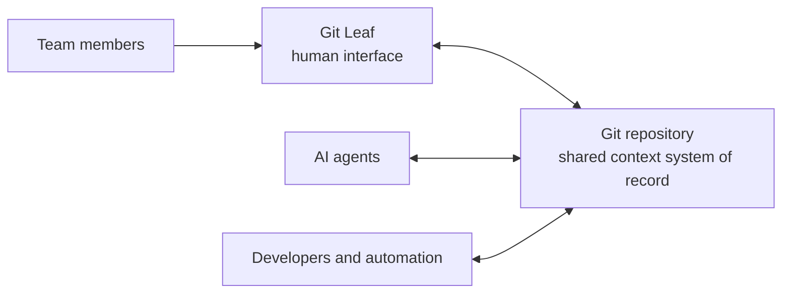

# Product positioning

[Marketing index](README.md)

## Baseline definition

> A desktop interface for Git repositories used as shared context by teams and AI agents.
>
> One repository for agents. A familiar interface for people.
>
> AI agents work directly in Git. People use Git Leaf to read, inspect, and make focused edits without
> working directly in Git or Markdown.

The first sentence describes the product and the repository it serves. The second is the memorable
tagline. The third explains the division of work without implying embedded agent execution.

## Object and role model

Git Leaf is the app and human interface. The Git repository is the durable shared context system of
record.

The repository may contain:

- knowledge and reference documents;
- agent instructions and skills;
- decisions, plans, and product context;
- operating rules, playbooks, and checklists;
- files produced or maintained by people, agents, developers, and automation.

A knowledge base can therefore be a content layer inside the repository. It is no longer the highest
level product category because the repository exists not only for human reference, but also to guide and
support agent work.

This model establishes four boundaries:

- Git Leaf does not own or host the repository content;
- agents do not need to go through Git Leaf;
- people do not need to use the same interface as agents and developers;
- all participants continue to act on the same ordinary files.

## Terminology hierarchy

| Term | Use | Boundary |
| --- | --- | --- |
| `Git repositories used as shared context` | Public category explanation | Descriptive and immediately understandable; preferred in the first sentence |
| `shared context repository` | Short product and strategy language | Define it on first use; do not capitalize it as a proprietary category |
| `knowledge base` | Familiar name for the repository's knowledge content | A component of the repository, not the app and no longer the global category |
| `shared context system of record` | Architecture and authority language | Explains durability and truth; too formal for the main tagline |
| `The human interface for the repository your agents work from.` | Campaign tagline | Strong and accurate when paired with the descriptive category sentence |
| `workspace` or `workbench` | Internal UI or session language | The app is not the content container; neither term defines the product |

`Context` is broader than the files in one repository. A model session may also use conversation
history, tools, MCP servers, retrieved data, and runtime state. Git Leaf therefore serves a durable
shared context source; it is not a complete context engine.

Avoid `AI context repository` as a standalone brand or unexplained category. The phrase can imply
semantic retrieval, cross-tool synchronization, embeddings, or MCP capabilities that Git Leaf does not
provide.

## Product hierarchy

### Primary object

A Git repository that a team and its AI agents rely on as shared context.

### Primary agent job

Read and modify the repository directly through an external agent client.

### Primary human job

Read the context, understand what changed, provide judgment, hand exact context back to an agent, and
make a focused edit when that is faster.

### Git Leaf's role

Provide the familiar, document-oriented desktop interface for that human job while preserving Git paths,
files, revisions, branches, and worktrees.

## Audience hierarchy

### Adopters

- technical and AI-platform leaders establishing repository-native agent workflows;
- repository maintainers who want durable team context to remain in Git;
- project and product leaders who need domain experts to inspect and correct agent-facing context.

### Daily users

- product, operations, research, policy, and management staff reading what agents rely on;
- domain experts checking an agent-updated document and supplying corrections;
- open-source and small-team members who need a readable view of shared repository context;
- knowledge owners maintaining high-value rules, decisions, and playbooks.

The primary market ranges from a few collaborators or an open-source project to a company. Team size is
not the deciding factor. The deciding factor is whether the repository is shared operational context for
people and agents.

## Product assumptions

### Repository-native context

Ordinary files are transparent, searchable, locally readable, versioned, and portable across agent
clients and developer tools. An agent can follow repository instructions, navigate to deeper documents,
and propose changes without importing the content into a separate platform.

Git Leaf assumes:

- durable context benefits from explicit paths, history, ownership, and reviewable files;
- people and agents should act on the same source rather than synchronize two knowledge systems;
- agent access remains independent of Git Leaf;
- the human interface should emphasize reading and inspection before editing.

### One repository, several interfaces

| Participant | Interface | Primary action |
| --- | --- | --- |
| AI agent | Codex, Claude, Copilot, or another agent client | Read and modify repository files |
| Team member | Git Leaf | Read, inspect, hand back context, and make focused edits |
| Developer or maintainer | IDE, terminal, and Git tools | Control code, branches, diffs, conflicts, and automation |

Git Leaf complements these tools instead of replacing them.

## Choice boundary: VS Code, Obsidian, or Git Leaf

The category is not justified merely because Git Leaf can open Markdown or a Git repository. VS Code
already provides complete graphical Git and development workflows. Obsidian already works with local
Markdown files and can add Git synchronization and diffs through community plugins.

The choice depends on the primary object and the human role:

- choose VS Code when repository participants are developers who want complete technical control;
- choose Obsidian when a human-authored Vault, links, and plugins are the center of the knowledge
  workflow;
- choose Git Leaf when the repository is shared agent context and the people responsible for its
  correctness need a readable, focused interface rather than a developer environment.

Git Leaf's independent reason to exist is the third case. It productizes the human return path into a
repository that agents and developers continue to use directly. See
[Why Git Leaf instead of VS Code or Obsidian?](why-git-leaf.md) for the complete argument and its
current product implications.

## Difference from a conventional knowledge-base app

A conventional knowledge-base app usually centers human capture, browsing, linking, retrieval, and
in-product collaboration. Git Leaf centers a repository that agents can use directly, then supplies the
human path back into that repository.

Git Leaf does not aim to reproduce bidirectional-link ecosystems, graphs, Canvas, plugin marketplaces,
general note-taking systems, built-in models, or hosted retrieval. If a Vault and its linking or plugin
system is the center of the work, Obsidian remains the more natural fit.

## Current evidence and boundaries

The current product proves:

- direct use of ordinary Git repository files by external tools;
- readable Preview and source-backed Source and Live modes;
- exact line selections exported as portable Agent Context;
- reload and continuation after external file changes;
- explicit remote synchronization and publication.

The current product does not provide:

- an embedded AI chat, agent runtime, or model host;
- automatic context selection or injection into an agent;
- semantic retrieval, embeddings, a vector database, or an MCP service;
- agent authorship, run history, or a formal diff-approval workflow.

See [Human-agent workflow](human-agent-workflow.md) for the complete product loop and the language that
current capabilities can support.
