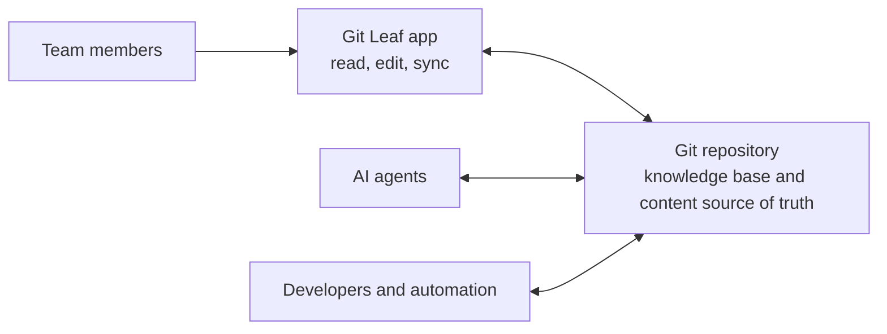

# Product positioning

[Marketing index](README.md)

## Baseline definition

> A desktop app for Git-based knowledge bases.
>
> Let the whole team maintain shared knowledge without requiring everyone to use Git or Markdown.
>
> Everyone on the team can contribute through Git Leaf, while developers and AI agents work with the
> same files directly in Git.

The first sentence defines the product category and the object it serves. The second states the primary
team problem. The third states the cross-role human-agent collaboration value. Do not collapse these
layers into one company-only or AI-only slogan: `team` describes the primary way the product is used,
while a company is only one possible team scale.

## Object model

Git Leaf is the app and tool. The Git repository opened in Git Leaf is the knowledge base, content
container, and source of truth.

This establishes the product boundary:

- ordinary repository files remain the knowledge content and source of truth;
- Git Leaf gives people a desktop interface to open, read, search, edit, and sync;
- agents, developers, and automation can read and modify the repository without going through Git Leaf;
- Git Leaf is not centered on agent chat, model hosting, or an agent runtime;
- Agent Context, deep links, and sharing strengthen collaboration but do not define the category.

## Why “knowledge base”

“Knowledge base” is a recognizable object for ordinary people and naturally includes open-source
documentation, small-team handbooks, project decisions, operating rules, and internal organizational
knowledge. Git Leaf serves that object, so the category is “for Git-based knowledge bases”; the app
itself is not “a knowledge base.”

| Candidate | Strength | Risk | Role |
| --- | --- | --- | --- |
| `Git-based knowledge bases` | Names the object and its Git foundation in familiar language | Needs a follow-up explaining that users need not operate Git | Product category |
| `Git-backed knowledge` | Emphasizes traceability and source-of-truth infrastructure | Sounds technical and “knowledge” is less concrete | Technical explanation |
| `local-first documentation workspace` | Communicates local files and documents | Can imply the app is the content container and narrows the product to documentation | Capability description |
| `The human interface for your AI-native knowledge base.` | Strong human-agent and AI-native campaign language | Can imply a technical or company-only audience | Campaign tagline |

“Workspace” can name a content/member/configuration boundary in Slack, Notion, or Coda, and a project
scope in VS Code. Using it as Git Leaf's product category conflicts with the fact that the repository is
the content container. “Workbench” sounds more like an IDE or specialist surface. Both may describe
internal UI state or a documentation working area, but neither defines the product.

## Audience hierarchy

### Daily users

Git Leaf prioritizes team members who do not work in Git or Markdown. They need to understand only that
they are opening and maintaining shared knowledge through a familiar document interface.

Natural users include:

- open-source contributors reading and updating shared documentation, rules, and decision records;
- members of small teams sharing handbooks, product material, and operating rules;
- operations, product, HR, sales, and management staff maintaining company knowledge;
- knowledge owners reviewing documents changed by AI agents.

### Adopters and influencers

- repository maintainers and technical leads who already keep team knowledge in Git;
- team leads who want members and multiple agents to share ordinary files;
- founders, technical leaders, and AI-platform leaders building AI-native ways of working.

### Primary market and flagship scenario

Teams that keep shared knowledge in Git are the primary market, whether they are a few collaborators, an
open-source project, a small organization, or a company. The common problem is not team size: it is that
Git works well as a shared source of truth while many members should not need developer tools to
participate.

Within that market, an AI-native team keeping rules, architecture, process, product knowledge, and agent
instructions in Git is the strongest flagship scenario. It has a clear adopter, a frequent human-agent
loop, and an acute cross-role participation problem. It should lead focused campaigns and landing pages,
without turning `AI-native company` into the global category.

## Product assumptions

### Git files are the shared source for people and agents

Ordinary files are transparent, searchable, locally readable, versioned, and usable by team members,
different agents, scripts, and developer tools. Online document products primarily optimize in-product
human collaboration and often require an API, permission connector, export, or platform-specific adapter
before an agent can act on their content.

Git Leaf assumes:

- durable, text-heavy knowledge can live in ordinary Git-controlled files;
- team members and agents should use the same files rather than synchronize two knowledge systems;
- agents and automation can access the repository directly;
- Git Leaf supplies the interface ordinary team members need.

### Git is friendly to agents and developers, not every team member

A raw repository exposes Markdown source, paths, commits, pulls, pushes, branches, worktrees, conflicts,
and developer tools. Git Leaf keeps that model correct underneath while presenting document-oriented
reading, editing, and synchronization.

## Difference from Obsidian

Obsidian and Git Leaf can both help people maintain knowledge. Git Leaf has a clear advantage when a team
uses Git as its shared source of truth and needs members, developers, and agents to use different tools
over the same files. Without that shared Git workflow, Git Leaf does not claim a broad advantage over
Obsidian.

| Obsidian | Git Leaf |
| --- | --- |
| A Vault is the local knowledge directory | A Git repository is the knowledge base and versioned source of truth |
| Centers note capture, linking, and organization | Centers teams and agents using the same Git files |
| Git is usually added by plugin or external tooling | Git underpins sync, revision, branch, and worktree |
| Emphasizes plugins, themes, and customization | Hides Git/Markdown complexity behind a consistent team experience |
| AI normally enters through product features or plugins | Agents can operate on the repository without Git Leaf |

Git Leaf does not aim to reproduce bidirectional-link ecosystems, graphs, Canvas, plugin marketplaces,
general note-taking systems, or built-in model management. Product complexity goes into keeping Git and
Markdown out of team members' way, safely publishing human edits, and making agent edits easy to reopen
and inspect.

## Core workflow

1. A team member opens the shared Git knowledge base in Git Leaf.
2. They find, read, and edit content through a document interface.
3. Sync publishes the change into the team's Git history.
4. Codex, Claude, or another agent reads the same repository and performs work.
5. The agent updates relevant repository documents.
6. The team member returns to Git Leaf to read, inspect, and continue those changes.

Team members use Git Leaf, agents and developers use the repository directly, and Git maintains the
shared source of truth.

## Applicability

Git Leaf does not replace every online document system. It is strongest for durable, versioned,
text-heavy knowledge that agents may use directly. Content that depends on real-time co-editing, complex
spreadsheets, or presentation layout can remain in a better-suited tool.
