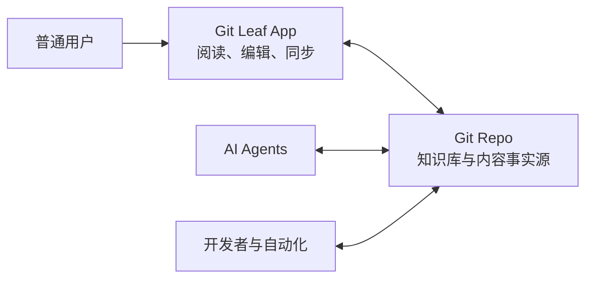

# 产品定位

[Marketing index](README.zh-CN.md) | 简体中文

## 基础定义

英文：

> A desktop app for Git-based knowledge bases.
>
> Open and maintain your knowledge base without working directly in Git or Markdown.
>
> Anyone can use Git Leaf, while AI agents work with the same files directly in Git.

中文：

> 面向 Git 知识库的桌面应用。
>
> 无需直接操作 Git 或 Markdown，即可打开并维护知识库。
>
> 任何人都可以使用 Git Leaf，AI Agent 则直接使用 Git 中的同一份文件。

第一句定义产品类别和服务对象；第二句说明 Git Leaf 为普通人解决的首要问题；第三句说明人和 AI 使用同一份文件的
核心价值。这三层不应压缩成一句只描述公司场景或只描述 AI 的口号。

## 对象关系

Git Leaf 是 App，是工具，不是知识库本身。用户在 Git Leaf 中打开和维护的 Git 仓库才是知识库及其内容容器。

这个关系决定了产品边界：

- Git 仓库中的普通文件是知识库内容和事实源，不迁移到 Git Leaf 数据库。
- Git Leaf 为人提供打开、阅读、搜索、编辑和同步知识库的桌面界面。
- AI Agent、开发者和自动化直接读取和修改同一仓库，不必经过 Git Leaf。
- Git Leaf 不以 Agent Chat、模型托管或 Agent 运行时为产品中心。
- Agent 上下文、Deep Link 和分享能力是协作增强，不定义产品类别。

## 为什么使用 knowledge base

`Knowledge base` 是普通用户已经能够识别的产品对象，也能自然覆盖个人笔记、开源项目文档、小团队手册和企业内部
知识。Git Leaf 服务的是这种对象，因此类别句采用 `for Git-based knowledge bases`，而不把 App 本身写成
`a knowledge base`。

几种相近表达的取舍：

| 表达 | 优点 | 主要问题 | 层级 |
| --- | --- | --- | --- |
| `Git-based knowledge bases` | 说明知识库以 Git 为基础，普通用户能理解服务对象 | 需要下文解释普通用户无须操作 Git | 产品类别，采用 |
| `Git-backed knowledge` | 更强调底层事实源和可追溯性 | `backed` 偏基础设施语气，`knowledge` 又比具体的 knowledge base 模糊 | 技术说明或正文 |
| `local-first documentation workspace` | 能表达本地、文件和文档 | 容易把 App 理解成内容容器；`documentation` 也会缩窄个人知识等场景 | 能力说明，不作类别 |
| `The human interface for your AI-native knowledge base.` | 能快速表现人机协作和 AI-native 场景 | 容易让人以为只面向 AI-native 公司或技术用户，且不能单独说明这是桌面 App | campaign tagline |

`Workspace` 可以自然表示 Slack、Notion、Coda 等产品中的内容、成员与配置边界，也可以指 VS Code 打开的项目范围。
当它直接充当 Git Leaf 的产品类别时，会与“Git 仓库才是内容库”发生歧义。`Workbench` 更像 IDE 或专业工具界面，
不符合面向普通大众的目标。因此两者都可以描述内部 UI 状态或本目录的协作空间，但不再定义 Git Leaf 是什么。

## 目标用户层级

### 日常用户

Git Leaf 优先服务不熟悉 Git 和 Markdown 的普通人。他们只需要知道自己正在打开一套知识库，可以像使用普通文档
工具一样阅读、搜索、编辑和同步。

自然进入的用户包括：

- 维护个人 Git 知识库、但不想每天操作 Markdown 源码和 Git 命令的个人用户；
- 阅读和更新开源项目文档、规则和决策记录的贡献者；
- 共享手册、产品资料和运行规则的小团队；
- 维护企业内部知识，但不熟悉 Git 的运营、产品、HR、销售和管理人员；
- 需要检查 AI Agent 所产生文档改动的知识负责人。

### 采用者与影响者

- 已经把 Markdown／MDX 文档放进 Git 的个人、开源维护者和团队负责人；
- 希望知识可以被多种 Agent 和自动化直接使用，而不绑定单一在线文档平台的团队；
- 正在建设 AI-native 工作方式的公司创始人、技术负责人和 AI 平台负责人。

### 旗舰场景，而不是类别限制

AI-native 公司把规则、架构、流程、产品知识和 Agent 指令维护在 Git 中，是当前最强的组织场景。它同时具备明确
采用者、普通员工痛点和高频人机循环，适合作为首要 ICP 和 campaign。但它应放在场景、案例、渠道和专门 landing
page 中，不应写进产品类别句，避免把个人、开源项目和普通小团队挡在门外。

## 基本假设

### Git 文件是人与 AI 的共同事实源

AI Agent 适合直接使用普通文件和目录：内容透明、可以搜索和局部读取，可以通过 Git 获得版本、diff、branch 和
revision，也可以被 CLI、脚本和不同 Agent 直接操作。

飞书文档、Google Docs 等在线文档首先为人类协作设计。AI 并非无法使用这些内容，但通常需要 API、权限、连接器、
导出或特定平台适配，知识并不天然存在于 Agent 可以直接操作的文件系统中。

Git Leaf 采用以下前提：

- 适合长期维护、以文本为主的知识可以保存在 Git 控制下的普通文件中。
- 人与 AI 使用同一份文件，不通过复制、导出或同步到另一个知识系统来协作。
- AI Agent、开发者和自动化直接访问仓库；Git Leaf 主要补上普通人需要的界面。

### Git 对 AI 和开发者友好，但对普通人不够友好

原生 Git 仓库会暴露 Markdown 源码、文件结构、commit、pull、push、branch、worktree、冲突和开发工具。Git Leaf
应把这些复杂度留在系统内部，为普通人提供接近文档工具的体验，同时不削弱底层 Git 的正确性和可追溯性。

## 与 Obsidian 的区别

Obsidian 和 Git Leaf 都可以帮助人维护知识库，因此 `knowledge base` 不是需要回避的概念。差异在于内容事实模型和
人机协作方式，而不是“个人产品”与“公司产品”的简单二分。

| Obsidian | Git Leaf |
| --- | --- |
| Vault 是本机知识库目录 | Git Repo 是知识库及版本化事实源 |
| 以人类记录、连接和组织笔记为中心 | 以普通人与 AI 共用同一组 Git 文件为中心 |
| Git 通常通过插件或外部工具加入 | Git 是同步、revision、branch 和 worktree 的底层模型 |
| 强调插件、主题和个人化能力 | 优先隐藏 Git／Markdown 复杂度，保持一致体验 |
| AI 通常通过产品能力或插件进入 Vault | AI Agent 可以直接操作仓库，不必经过 Git Leaf |

Git Leaf 不以追赶双向链接生态、知识图谱、Canvas、插件市场、个人效率系统或内置模型管理为目标。产品复杂度优先
投入到：普通人无须理解 Git 和 Markdown、人的修改可以安全进入 Git、Agent 改动容易被人重新打开和检查。

## 核心工作流

最能代表 Git Leaf 的完整场景是：

1. 用户使用 Git Leaf 打开一套 Git 知识库。
2. 用户像使用普通文档工具一样查找、阅读和修改内容。
3. 用户执行简单同步，修改进入普通 Git 历史。
4. Codex、Claude 或其他 AI Agent 直接从仓库读取最新知识并完成任务。
5. Agent 根据工作结果修改仓库中的相关文档。
6. 用户回到 Git Leaf 阅读、检查和继续编辑 Agent 的改动。

产品闭环是：人通过 Git Leaf 使用仓库，AI 直接使用仓库，Git 维护共同事实。

## 适用边界

Git Leaf 不试图替代所有在线文档。它首先适合需要长期维护、可版本化、以文本为主，并且可能被 AI Agent 直接使用
的知识；高度依赖实时共同编辑、复杂电子表格或演示排版的内容可以继续留在更适合的工具中。
